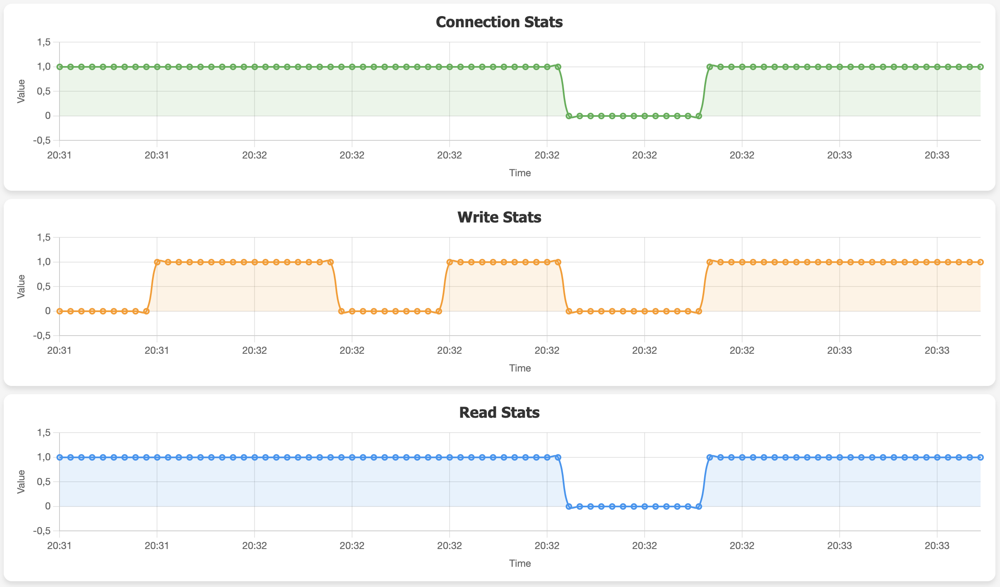

MySQL/PostgreSQL availability monitoring app
=============

This app is used to monitor whether MySQL or PostgreSQL database is available
(in this case for blue/green deployment on AWS RDS). Below I describe how the
application is built.

First, let's create a function that will connect to the MySQL database. It will
count the connection successes and failures with timestamps (we will use it for
graphs later) as well as do some simple read and write operations. Equivalent
code for PostgreSQL is provided here:
[check_postgresql.py](./check_postgresql.py).

```python
import mysql.connector
from datetime import datetime

MYSQL_STATS = {"connection": [], "write": [], "read": []}

def check_read_write(timestamp, cursor, connection):
    """Check read and write operations on the MySQL database."""
    read_result = 0
    try:
        cursor.execute("SELECT * FROM test_table ORDER BY timestamp DESC LIMIT 5")
        read_result = 1 if cursor.fetchone() else 0
        cursor.fetchall()
    except mysql.connector.Error as err:
        read_result = 0
    
    write_result = 0
    try:
        cursor.execute("INSERT INTO test_table (timestamp) VALUES (%s)", (timestamp.replace(microsecond=0),))
        connection.commit()
        cursor.execute("SELECT timestamp FROM test_table ORDER BY timestamp DESC LIMIT 1")
        result = cursor.fetchone()
        write_result = 1 if result and result[0] == timestamp.replace(microsecond=0) else 0
        cursor.fetchall()
    except mysql.connector.Error as err:
        write_result = 0
    
    return read_result, write_result


def check_mysql(host, port, user, password, database):
    """Check MySQL connection, read and write operations."""
    global MYSQL_STATS
    timestamp = datetime.now()
    read_result = 0
    write_result = 0
    connection_result = 0
    try:
        connection = mysql.connector.connect(host=host, port=port, user=user, password=password, database=database)
        if connection and connection.is_connected():
            connection_result = 1
            with connection.cursor() as cursor:
                read_result, write_result = check_read_write(timestamp, cursor, connection)
    finally:
        if 'connection' in locals() and connection and connection.is_connected():
            connection.close()
    MYSQL_STATS["connection"].append( (timestamp, connection_result) )
    MYSQL_STATS["write"].append( (timestamp, write_result) )
    MYSQL_STATS["read"].append( (timestamp, read_result) )

def get_stats():
    global MYSQL_STATS
    return MYSQL_STATS
```

Next we can create a FastAPI application that will serve an HTML+JS page that
will dynamically update the graph using the `/stats` endpoint. I will also load
the environment variables that will be used as database connection parameters.

```python
from fastapi import FastAPI
from fastapi.responses import HTMLResponse
from check_mysql import get_stats
from os import getenv

conn_params = {
    "host": getenv("DB_HOST", "localhost"),
    "port": int(getenv("DB_PORT", 3306)),
    "user": getenv("DB_USER", "root"),
    "password": getenv("DB_PASSWORD", "password"),
    "database": getenv("DB_NAME", "test_db")
}

app = FastAPI()

@app.get("/", response_class=HTMLResponse)
async def root():
    with open("index.html", "r") as f:
        return f.read()

@app.get("/stats")
async def stats():
    return get_stats()
```

Currently, the `stats` endpoint just returns a JSON object with empty arrays. To
gather the data, I will define a helper class that will run `check_mysql` in a
separate thread every second. It will also allow to gracefully be stopped when
an exit signal is received.

```python
import threading, time, signal, sys
from check_mysql import check_mysql

class Monitor:
    def __init__(self, args=None):
        self.active = False
        self.args = args
        self.thread = threading.Thread(target=self.run, daemon=True)
        signal.signal(signal.SIGINT, self.signal_handler)
        signal.signal(signal.SIGTERM, self.signal_handler)
        
    def run(self):
        while self.active:
            try:
                time.sleep(1)
                check_mysql(**self.args)
            except Exception as e:
                print(f"Error in monitoring thread: {e}")
                break

    def stop(self):
        self.active = False
        if self.thread and self.thread.is_alive():
            self.thread.join(timeout=5)

    def start(self):
        self.active = True
        self.thread.start()

    def signal_handler(self, signum, frame):
        print(f"Received signal {signum}, shutting down...")
        self.stop()
        sys.exit(0)
```

In order to bind the new thread to the FastAPI application, we can use lifespan
along with `asynccontextmanager` to ensure that the thread is started and
stopped along the application lifecycle. We can edit the `app.py` file to
include the following:

```python
...
from monitor import Monitor
from contextlib import asynccontextmanager

@asynccontextmanager
async def lifespan(app: FastAPI):
    global monitor_thread, conn_params
    monitor_thread = Monitor(args=conn_params)
    monitor_thread.start()
    
    yield
    
    if monitor_thread:
        monitor_thread.stop()

app = FastAPI(lifespan=lifespan)
...
```

The frontend HTML page is pretty long and uses `chart.js` to render the graphs.
You can find it in the repository here:
[]().
Such application can be packed into a Docker image, such as the one below:

```dockerfile
FROM python:3.13-alpine

WORKDIR /app

RUN pip install mysql-connector-python \
     fastapi
     uvicorn
     psycopg2-binary

COPY *.py *.html .

CMD ["uvicorn", "app:app", "--host", "0.0.0.0", "--port", "8000"]
```

Testing the application
-------------------

Before we deploy this to AWS, we can very easily test it locally. To do this, I
will use Docker Compose to run the application and a MySQL database. I will init
the database with a script that will create the `test_table`. To also allow the 
read test to pass, I will create a single record in the table. When the SQL
script has execution permissions on Linux/Mac and you mount it into
`/docker-entrypoint-initdb.d/` it will be executed on the database container
startup. Save this to `mysql-init.sql` and do `chmod +x mysql_init.sql` on it:

```sql
USE app_db;

CREATE TABLE IF NOT EXISTS test_table (timestamp TIMESTAMP);

INSERT INTO test_table (timestamp)
SELECT NOW()
WHERE NOT EXISTS (SELECT 1 FROM test_table);
```

Now we can create a `docker-compose.yml` file to run the application and perform
some tests. I will build the application image from the `Dockerfile` and run it
on port `18000` of your system.

```yaml
services:
  web:
    build:
      context: .
      dockerfile: Dockerfile
    ports:
      - "18000:8000"
    depends_on:
      - db
    environment:
      - DB_HOST=db
      - DB_PORT=3306
      - DB_USER=app_user
      - DB_PASSWORD=app_password
      - DB_NAME=app_db

  db:
    image: mysql:8.0
    environment:
      - MYSQL_DATABASE=app_db
      - MYSQL_USER=app_user
      - MYSQL_PASSWORD=app_password
      - MYSQL_ROOT_PASSWORD=root_password
    volumes:
      - ./mysql-init.sql:/docker-entrypoint-initdb.d/mysql-init.sql
```

When you reach out to `http://localhost:18000`, you should see the application
running and showing the graphs. The dips in the graphs are me setting the
database to read-only mode and then back to read-write and stopping it entirely
and starting again.



```bash
docker exec -it monitoring-app-db-1 mysql -u root -proot_password -e 'SET GLOBAL read_only = 1;'
docker exec -it monitoring-app-db-1 mysql -u root -proot_password -e 'SET GLOBAL read_only = 0;'
docker stop monitoring-app-db-1
docker start monitoring-app-db-1
```